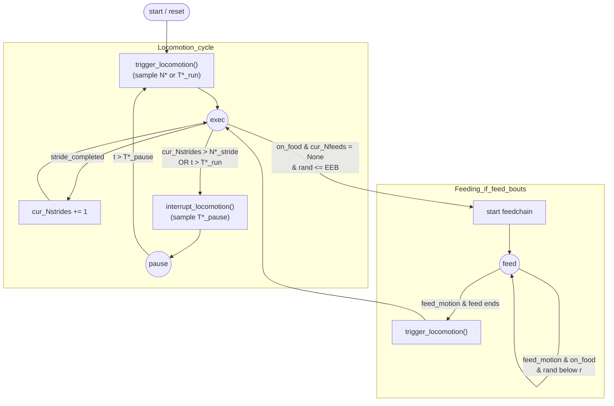

# Intermitter: Bout-Generation & Transition Pipeline (Equations)

## Flowchart overview

## State space
`S(t) ∈ {exec, pause, feed}`

## Time update (per step)
`t ← t + Δt`, `ticks ← ticks + 1`

---

## Pipeline: Locomotion (exec ↔ pause)

### 1) Bout targets (when entering a state)
- On the first call, or whenever a pause ends, `trigger_locomotion()` is called:
  - If `run_mode = stridechain`: sample target stride count `N_strides^* ~ D_stridechain`.
  - If `run_mode = exec`: sample target run duration `T_run^* ~ D_run`.
- Whenever an exec bout ends, `interrupt_locomotion()` is called and samples pause duration `T_pause^* ~ D_pause`.

### 2) Accumulation during exec
- On each time step, an external flag `stride_completed` may be true.
- If `stride_completed`:
  
  `N_strides ← N_strides + 1`

### 3) Transition rules
- End exec and enter pause:
  
  `if (N_strides > N_strides^*) OR (t > T_run^*) ⇒ exec → pause`

- End pause and enter exec:
  
  `if t > T_pause^* ⇒ pause → exec`

---

## Pipeline: Feeding (explore/exploit)

### 1) Feed chain initiation
When on food and not feeding:
  
`P(start_feed) = EEB`

### 2) Feed repetition during feed
On a feed motion:
- Increment feed count:
  
`N_feed ← N_feed + 1`

- If on food:
  
`P(repeat_feed) = r`  
`r = feeder_reoccurence_rate` (or `EEB` if configured)

- If not on food:
  
`feed → exec`

---

## Statistics (cumulative)
Mean feed frequency:

`f_feed = N_feed / T_total`

Bout duration ratio:

`R_b = (Σ D_b) / T_total`

---

## EEB–feed-frequency mapping (get_EEB_poly1d)

For a fixed `OfflineIntermitter` configuration (crawl/feeding frequencies, bout distributions, `dt`), the function `get_EEB_poly1d` numerically explores a grid of EEB values, simulates long trajectories, and records the corresponding mean feeding frequency `f_feed(EEB)`.

Conceptually this defines the forward mapping

$$
\mathrm{EEB} \;\mapsto\; f_{\mathrm{feed}}(\mathrm{EEB} \mid \text{config}) \, ,
$$

relating exploitation–exploration balance to mean feeding rate for that configuration.

In the implementation, the sampled pairs \((f_{\mathrm{feed}}, \mathrm{EEB})\) are then used to fit a 5th‑order polynomial \(z\) such that

$$
f_{\mathrm{feed}} \;\mapsto\; z\big(f_{\mathrm{feed}}\big) \;\approx\; \mathrm{EEB} \, ,
$$

providing an approximate inverse mapping from observed mean feeding frequency back to the underlying EEB.

---

# Subclasses: Distribution Overrides

## BranchIntermitter
Stridechain:
  
`N_strides^* ~ exp_bout(β, t_min, t_max)`

Pause:
  
`T_pause^* ~ critical_bout(c, σ, N, t_min, t_max) · Δt`

## OfflineIntermitter (fixed frequency detection)
Stride event every:
  
`T_stride = 1 / f_crawl`

Feed event every:
  
`T_feed = 1 / f_feed`

Flags:
  
`stride_completed ⇔ ticks mod (T_stride/Δt) = 0`  
`feed_motion ⇔ ticks mod (T_feed/Δt) = 0`

## FittedIntermitter
Parameters loaded from reference dataset:
  
`{crawl_freq, feed_freq, dt, stridechain_dist, pause_dist, reoccur_rate}`
